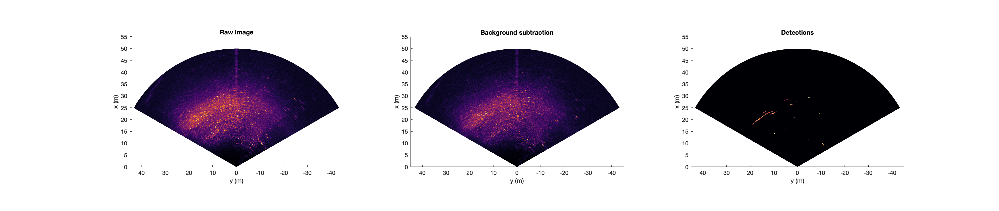
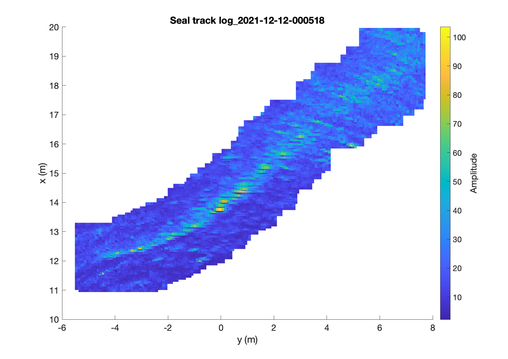

# mattrichech

## Introduction

MATLAB tools to annotate seal tracks from Tritech Gemeni multi-beam sonar data. 

## Usage

_test/readgpl.m_ is a good place to start for an example of how the code works.  _sonardataj.m_ opens  .gpl files which contain the multibeam sonar data. This function is based on a Java library which does most of the heavy lifting to access the file and organise contents. Each file contains multiple frames of multibeam data - _plotsonarimag.m_ can then be used to create a plot of a single frame of multibeam data. 

  

_An example of the sonar data plotted in readgpl.m script_

## Annotating animal tracks

The script _annotate_seal_tracks.m_ can be used to annotate animal tracks. The script opens a multibeam file and iterates through an user-defined set of frames. The user can then mark an animal on each frame. Once the annotations have completed the script extracts relevent data from different multibeam (e.g. an image of the target in each frame, signal and noise metrics) and packages into a single MATLAB structure which is saved as a .mat file. This file can then be used to calculate signal to noise metrics, train classifiers etc. 

  

_A manually annoated seal track. This is all the detectins from all frames stacked on top of each other to create one image_

